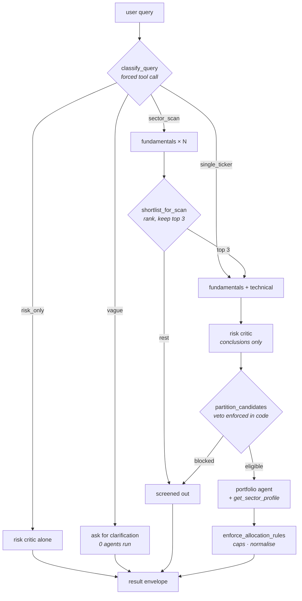

# Undervalued Stock Orchestrator

A multi-agent stock research system built directly on the Anthropic Messages API — no agent framework. A coordinator classifies an incoming query, decides which specialist agents actually need to run, and a portfolio agent turns their verdicts into an allocation.

The interesting parts aren't the stock picking. They're the architectural choices: what each agent is allowed to see, where model judgement ends and code enforcement begins, and how a coordinator avoids decomposing a broad question so narrowly that it answers nothing.

---

## Architecture



**Hub and spoke.** The coordinator is the only component that talks to more than one agent. No specialist knows the others exist.

**Isolated context.** Every agent builds its message history from scratch. Nothing is inherited; anything an agent needs is passed explicitly in its prompt.

| Component | Sees | Tools |
|---|---|---|
| `coordinator` | the raw query | `submit_routing_plan` |
| `fundamentals_agent` | one ticker | valuation, health, growth, ownership |
| `technical_agent` | one ticker | trend, momentum, relative strength |
| `risk_critic_agent` | the other two agents' **conclusions**, not their reasoning | risk flags |
| `portfolio_agent` | every surviving candidate's verdicts | sector profile |

## Routing

Not every query needs every agent. The coordinator classifies first, then spends accordingly.

| Query type | Path | Cost |
|---|---|---|
| `vague` | ask which ticker or sector they meant | 1 call, no agents |
| `risk_only` | risk critic only | 1 agent per ticker |
| `sector_scan` | fundamentals on all → top 3 → technical + risk → portfolio | N + 3×2 + 1 |
| `single_ticker` | full deep dive → portfolio | 3 per ticker + 1 |

A pure risk question skips fundamentals and technical entirely, and never builds a portfolio — it asked what could go wrong, not what to buy.

---

## Three design decisions

### 1. The risk critic sees conclusions, not reasoning

It receives the fundamentals and technical agents' structured verdicts and nothing else. Handing it their full reasoning trail makes it far more likely to rationalise their analysis than to critique it. Fresh eyes require an absence of context, not an abundance of it.

### 2. The model proposes, code disposes

Advisory judgement belongs to the model. Anything that must hold *regardless of how persuasive the reasoning sounds* belongs in Python.

| Enforced in code | Left to the model |
|---|---|
| A rejection requires a named solvency-grade cause | Whether such a cause exists |
| Risk-critic vetoes filter candidates before the portfolio agent runs | Which names to hold |
| Position cap (35%), sector cap (60%) | Position sizing within the caps |
| Allocations always total 100% | How much cash to carry |
| Rejected tickers stripped if reinstated | The thesis for each holding |

This isn't theoretical caution. Observed against the live API:

- the portfolio agent returned `positions` as bare ticker strings instead of objects
- it omitted `concentration_notes` despite it being a `required` field
- it listed a risk-rejected ticker among its holdings
- the risk critic rejected a candidate on valuation grounds, with `hard_veto_triggered` set

The last one is the instructive one. Its prompt says, in as many words, that a rich multiple is a flag and *never* a rejection, and that `hard_veto_triggered` is reserved for going-concern language, restatements, covenant breaches and legal action. It rejected AMD anyway, citing a 129x P/E, a low FCF yield and high beta — none of them a solvency question, and all of them concerns the fundamentals agent had already priced into an `overvalued` verdict. The same objection, counted twice, at the one severity that stops a candidate dead. On the same prompt it had produced three correct `approved_with_caution` verdicts during a sector scan an hour earlier.

Asking more firmly was not the fix. `submit_risk_assessment` now requires a `veto_category` naming which solvency-grade problem applies, and `enforce_veto_contract` downgrades any rejection whose category is `none` to `approved_with_caution`, keeping the stated reasons as risk flags and recording the override:

```json
"overrides": ["rejection downgraded to approved_with_caution: no solvency-grade cause named (veto_category='none'). Stated reasons kept as risk flags."]
```

The model still decides whether a solvency-grade problem exists. It just can't spend a veto without naming one. The signal now reaches the portfolio stage to be sized down, instead of being destroyed upstream.

A schema is a strong instruction, not an enforced contract.

Every correction the code makes is recorded in `adjustments` rather than applied silently — a rewritten allocation you can't see is worse than one you can argue with.

### 3. A comparative question needs a comparative gate

The sector scan originally passed a ticker through only if fundamentals returned `undervalued`. Run against live data, that gate rejected **11 of 11 tickers across two sectors**, and the system returned an empty portfolio for every scan.

The bug wasn't strictness. "Find me undervalued semiconductors" is a comparative question, and it was being answered with a bar set in isolation — a coordinator decomposing a broad research task so narrowly that the broad task got no coverage at all.

The fix has two halves. The fundamentals agent now emits a `valuation_score` alongside its verdict, because a three-way enum flattens out exactly the gradation that "least expensive of a rich sector" needs. The coordinator ranks on `(verdict tier, score)` and carries the top 3 through — always non-empty, never a bar.

Survivors are tagged with the basis they cleared on, so nothing downstream mistakes *best available* for *cheap*:

```json
"screen": { "basis": "relative", "sector_rank": 1, "of": 6 }
```

The portfolio agent reads that tag and sizes relative-basis candidates more conservatively.

The scan gate was only half the problem. The risk critic was independently rejecting candidates on valuation grounds — re-deciding a question the fundamentals agent had already answered, whose verdict was sitting in its own prompt — so names that survived the gate died one stage later for the same reason. Narrowing its remit in the prompt was not enough on its own; see the veto contract in decision 2 for what actually made it hold.

---

## Example

```
$ python coordinator.py "Find me undervalued semiconductor stocks"

Routing plan: {'query_type': 'sector_scan', 'sector': 'semiconductor', 'tickers': []}
Tickers in scope: ['NVDA', 'AMD', 'AVGO', 'TSM', 'QCOM', 'INTC']
```

| Rank | Ticker | Verdict | Score | Basis | Outcome |
|---:|---|---|---:|---|---|
| 1 | TSM | fairly_valued | 55 | relative | full analysis → approved_with_caution |
| 2 | QCOM | fairly_valued | 52 | relative | full analysis → approved_with_caution |
| 3 | AVGO | fairly_valued | 48 | relative | full analysis → approved_with_caution |
| 4 | NVDA | overvalued | 28 | relative | screened out |
| 5 | AMD | overvalued | 22 | relative | screened out |
| 6 | INTC | overvalued | 15 | relative | screened out |

Resulting book:

```
QCOM    22.00%  medium   Good technical pullback entry (RSI 49.4), forward P/E 18.5x
TSM     16.00%  low      Fortress balance sheet, 40% ROE, but extended entry point
CASH    62.00%
```

The 62% cash is the system working. All three candidates cleared on a *relative* basis, the portfolio agent was told so, and it sized accordingly rather than mistaking a shortlist for a bargain.

---

## Running it

```bash
python3 -m venv venv
./venv/bin/pip install -r requirements.txt
cp .env.example .env        # add your ANTHROPIC_API_KEY
```

Calling `./venv/bin/python` directly avoids needing to activate anything — and macOS ships no bare `python`, only `python3`, so an unactivated `python …` fails there.

```bash
./venv/bin/python coordinator.py "Is AMD a good long-term buy?"
./venv/bin/python coordinator.py "Find me undervalued semiconductor stocks"
./venv/bin/python coordinator.py "What are the risks with INTC?"
./venv/bin/python coordinator.py "Is AMD a good buy?" --no-synthesis
```

Add `-u` (`./venv/bin/python -u coordinator.py …`) to watch progress live when redirecting output to a file — otherwise stdout is block-buffered and nothing appears until the run ends.

Each agent also runs standalone:

```bash
./venv/bin/python agents/fundamentals_agent.py NVDA
./venv/bin/python agents/portfolio_agent.py NVDA AMD JPM
```

Defaults to `claude-haiku-4-5`; override with `CLAUDE_MODEL` in `.env`.

## Tests

```bash
./venv/bin/pip install -r requirements-dev.txt
./venv/bin/python -m pytest
```

86 tests, ~0.8s, entirely offline — no API key, no network. The agent loop is driven by a scripted stub client and the data tools are stubbed. A suite that needs a funded API key to tell you whether the allocation maths is right is a suite you stop running.

Coverage is weighted toward failure paths, because those are the ones you don't notice breaking:

- **`test_agent_loop.py`** — `end_turn` recovery, iteration caps, tool exceptions, NaN sanitisation
- **`test_portfolio_agent.py`** — veto enforcement, position/sector caps, allocation normalisation, malformed model output
- **`test_risk_critic.py`** — the veto contract: unjustified rejections downgraded, genuine ones preserved
- **`test_coordinator.py`** — routing decisions, shortlist ranking, envelope consistency

## Layout

```
coordinator.py              routing, funnel, orchestration
agents/
  agent_loop.py             shared tool-use loop
  fundamentals_agent.py     valuation and financial health
  technical_agent.py        trend and entry quality
  risk_critic_agent.py      red flags and vetoes
  portfolio_agent.py        sizing, concentration, enforcement
tools/market_data.py        yfinance wrappers
tests/                      offline suite
```

The shared loop in `agents/agent_loop.py` handles what a naive `while True` doesn't:

- **`stop_reason == "end_turn"`** — the model gathers its data then writes a prose summary instead of calling its submit tool. Observed roughly one run in four against Haiku; across a scan that fans out to ~18 agent runs, near-certain. The loop nudges it back to the tool rather than treating it as fatal.
- **Unbounded iteration** — capped at 10 round trips.
- **A tool that raises** — the error is returned to the model as a tool result, so one delisted ticker doesn't kill a whole scan.

---

## Limitations

- **Sequential.** A six-ticker scan runs its agents one at a time. Parallelising is the obvious next win.
- **No caching.** `yfinance.Ticker(...).info` is refetched per tool call; a scan repeats a lot of network work.
- **`.info` is thin.** Credit ratings, going-concern language and institutional ownership aren't available from it, so they're `None` rather than faked.
- **Advisory only.** The risk veto is model-judged, and a human reviews the output. If this ever executed trades directly, that veto would need to be a hard programmatic gate, not an agent's judgement call.
- **Not investment advice.** It's an architecture demo that happens to analyse stocks.
