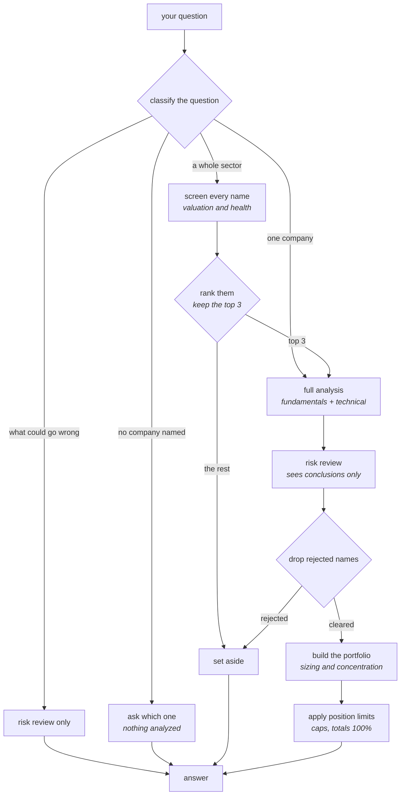

# Undervalued Stock Orchestrator

A multi-agent stock research system built on the raw Anthropic Messages API, with no agent framework underneath it.

A coordinator classifies the incoming query, works out which specialist agents actually need to run, and hands their verdicts to a portfolio agent that turns them into an allocation.

I built this to learn agentic orchestration properly before reaching for a framework. I wanted to focus on the architecture. For example, what each agent is allowed to see, where model judgment stops and code enforcement starts, and how a coordinator can break a question up so narrowly that it ends up answering nothing.

Design reasoning lives in [DESIGN.md](DESIGN.md), including the three bugs that taught me the most.

## Domain selection

Before building this harness, I wanted a domain with a valuable use case for a lot of people, and one I understood well enough to judge whether the output was any good. Financial literacy is in the interest of many people, so I thought this would be helpful. Different investors have different strategies. One that tends to be fruitful is finding stocks that are undervalued. That means researching a lot of stocks and reviewing various key metrics, which is time consuming. Each metric tells part of the story. Combining them gives an interpretation. So I thought, what if I could build a system that gives a verdict?

## Architecture



The coordinator is the only component that talks to more than one agent. No specialist knows the others exist.

Every agent builds its message history from scratch. Nothing is inherited, so anything an agent needs has to be passed explicitly in its prompt.

| Component | Sees | Tools |
|---|---|---|
| `coordinator` | the raw query | `submit_routing_plan` |
| `fundamentals_agent` | one ticker | valuation, health, growth, ownership |
| `technical_agent` | one ticker | trend, momentum, relative strength |
| `risk_critic_agent` | the other two agents' **conclusions**, not their reasoning | risk flags |
| `portfolio_agent` | every surviving candidate's verdicts | sector profile |

## Routing

Not every question needs every agent, so the coordinator works out what to run before it runs anything.

| What you ask | What runs | Agents used |
|---|---|---|
| "What should I invest in?" | It asks which company or sector you meant | none |
| "What are the risks with INTC?" | Risk review on its own | 1 |
| "Is AMD a good long-term buy?" | Full analysis, then a portfolio | 4 |
| "Find me undervalued bank stocks" | All five names screened, top three get the full treatment, then a portfolio | 12 |

A pure risk question skips valuation and trend work completely, and never builds a portfolio. It asked what could go wrong, not what to buy.

Each agent listed above is one full reasoning loop, so it usually costs several API calls rather than one. Internally these routes are named `vague`, `risk_only`, `single_ticker` and `sector_scan`, which is what appears in the output.

## Example

```
$ ./venv/bin/python coordinator.py "Find me undervalued bank stocks"

Routing plan: {'query_type': 'sector_scan', 'sector': 'banking', 'tickers': []}
Tickers in scope: ['JPM', 'BAC', 'WFC', 'C', 'USB']
```

| Rank | Ticker | Verdict | Score | Basis | Outcome |
|---:|---|---|---:|---|---|
| 1 | JPM | fairly_valued | 55 | relative | full analysis, approved_with_caution |
| 2 | BAC | fairly_valued | 52 | relative | full analysis, approved_with_caution |
| 3 | C | fairly_valued | 35 | relative | full analysis, approved_with_caution |
| 4 | WFC | fairly_valued | 35 | relative | screened out |
| 5 | USB | overvalued | 35 | relative | screened out |

Resulting book:

```
JPM     35.00%  high     ROE 17.8%, strongest fundamentals of the five
BAC     25.00%  medium   Acceptable valuation, deteriorating business metrics
C       10.00%  low      Starter position, weakest of the three
CASH    30.00%

adjustments: ['JPM: 50.0% trimmed to 35.0% (single-position limit)']
```

The model proposed 50% in JPM and the position cap trimmed it, recording the trim. Its written thesis still quotes the pre-trim figure, so the summary carries a note pointing at `adjustments`.

All three names cleared on a *relative* basis and all three showed extended entries, which is where the 30% cash comes from. The agent put it better than I would: *"warranted a cash reserve for discipline, not sector avoidance."*

Scores are model judgments, so they move between runs. Ranks are not stable across invocations.

## Running it

```bash
python3 -m venv venv
./venv/bin/pip install -r requirements.txt
cp .env.example .env        # add your ANTHROPIC_API_KEY
```

Calling `./venv/bin/python` directly saves activating anything. It also sidesteps the fact that macOS ships no bare `python`, only `python3`, so an unactivated `python ...` just fails.

```bash
./venv/bin/python coordinator.py "Is AMD a good long-term buy?"
./venv/bin/python coordinator.py "Find me undervalued semiconductor stocks"
./venv/bin/python coordinator.py "What are the risks with INTC?"
./venv/bin/python coordinator.py "Is AMD a good buy?" --no-synthesis
```

Output is block-buffered when redirected to a file, so add `-u` if you want to watch a long run progress.

Each agent also runs standalone:

```bash
./venv/bin/python agents/fundamentals_agent.py NVDA
./venv/bin/python agents/portfolio_agent.py NVDA AMD JPM
```

Defaults to `claude-haiku-4-5`. Override with `CLAUDE_MODEL` in `.env`.

## Tests

```bash
./venv/bin/pip install -r requirements-dev.txt
./venv/bin/python -m pytest
```

123 tests, under a second, entirely offline. No API key and no network: the agent loop runs against a scripted stub client and the data tools are stubbed. I wanted a suite I would actually keep running, which ruled out anything that costs money to execute.

Coverage leans heavily toward failure paths, since those are the ones that break quietly:

- **`test_agent_loop.py`** covers `end_turn` recovery, iteration caps, tool exceptions, NaN sanitization
- **`test_portfolio_agent.py`** covers veto enforcement, position and sector caps, allocation normalization, malformed model output
- **`test_risk_critic.py`** covers the veto contract, checking that unjustified rejections are downgraded and genuine ones survive
- **`test_coordinator.py`** covers routing decisions, shortlist ranking, envelope consistency

## Layout

```
coordinator.py              routing, funnel, orchestration
agents/
  agent_loop.py             shared tool-use loop
  fundamentals_agent.py     valuation and financial health
  technical_agent.py        trend and entry quality
  risk_critic_agent.py      red flags and vetoes
  portfolio_agent.py        sizing, concentration, enforcement
tools/market_data.py        yfinance wrappers
tests/                      offline suite
```

All four specialists share one loop in `agents/agent_loop.py`, which handles three things a plain `while True` does not:

- **`stop_reason == "end_turn"`.** The model gathers its data and then writes a prose summary instead of calling its submit tool. I saw this roughly one run in four against Haiku, and a sector scan fans out to about 18 agent runs, so it was close to guaranteed on every scan. The loop nudges the model back to the tool instead of treating it as fatal.
- **Unbounded iteration**, capped at 10 round trips.
- **A tool that raises.** The error goes back to the model as a tool result, so one delisted ticker cannot kill an entire scan.

## Limitations

- **Sequential.** A six-ticker scan runs its agents one at a time. Parallelizing is the obvious next win.
- **No caching.** `yfinance.Ticker(...).info` is refetched on every tool call, so a scan repeats a lot of network work.
- **`.info` is thin.** Credit ratings, going-concern language and institutional ownership are not available from it, so they come back as `None` rather than being faked.
- **Advisory only.** The risk veto is model-judged and a human reviews the output. If this ever placed trades directly, that veto would need to be a hard programmatic gate instead of an agent's opinion.
- **Not investment advice.** It is an architecture demo that happens to analyze stocks.
